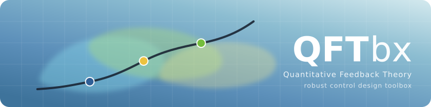

  

  
  
  

Academic-oriented software for QFT-based analysis and automatic loop shaping

---

## Overview

QFTbx is a graphical and computational toolbox for the design and analysis of robust controllers using Quantitative Feedback Theory (QFT).

The software is mainly oriented towards academic and research use, although it can also be useful for control engineers interested in QFT-based methodologies.
It provides tools for automatic loop shaping, interval analysis, and visualization of QFT constraints.

This software is currently under active development. Some features may be incomplete or experimental.

---

## Dependencies

Required
- CMake >= 3.17
- Qt >= 6.x
- C++ compiler with C++20 support

Optional
- OpenMP >= 11
- CUDA >= 7
- Doxygen (for documentation generation)

Bundled or fetched automatically (nothing to install by hand)
- kv, Masahide Kashiwagi's verified computation library (header-only, MIT):
  the interval arithmetic under the loop-shaping algorithms, vendored in
  `3rd-party/kv` (only the headers the toolbox uses).
- QCustomPlot (plots): vendored in `3rd-party/`.
- pugixml (project files): fetched with FetchContent at configure time,
  so the first configuration needs network access.

---

## Configuration options

Dependencies and features can be enabled or disabled directly from the main CMakeLists.txt file using the following options:

OPTION (USE_CLANG       "Use CLANG"             OFF)
OPTION (USE_OpenMP      "Use OpenMP"            ON)
OPTION (USE_CUDA        "Use CUDA"              OFF)
OPTION (USE_Doxygen     "Use Doxygen"           OFF)
OPTION (USE_NATIVE_ARCH "Enable -march=native"  ON)
OPTION (QFTBX_BUILD_TESTS "Build unit tests"    ON)

Automatic configuration is applied based on the selected options and the available system libraries.

### A note on the interval arithmetic

kv is used in its rounding-emulation mode (`KV_NOHWROUND`): the directed
roundings are computed with error-free transformations instead of switching
the floating-point rounding mode, so the rigour of the interval arithmetic
does not depend on compiler flags, on the optimisation level or on which
thread runs it. The logarithms and arc tangents of the projection take the C
library's values widened by four ulps, twice the largest error glibc lists
for them, because kv's series enclosures are hundreds of times slower and
the loop-shaping algorithms call them millions of times.
`tests/backend/interval_test.cpp` checks the enclosure properties the
loop-shaping algorithms rely on, and that the rounding mode is left
untouched.

---

## Build instructions

Linux / Windows (MinGW)

mkdir build
cd build
cmake ..
make

If all dependencies are correctly installed, the project can be compiled on Linux (using GCC or Clang) or Windows (using MinGW).

---

## Tests

The project ships a suite of unit, characterisation and golden tests
(GoogleTest, fetched at configure time). It is built by default; run it
from the build directory:

    ctest

or, for the detail of a failure:

    ctest --output-on-failure -R <test name>

The suite covers the plant/uncertainty model, the frequency set, the
specifications, the templates and their contours, the boundaries, the
persistence round-trip, the five loop-shaping algorithms (against
published results where they exist) and the rigour of the interval
arithmetic. The goldens pin current behaviour; correctness of each
algorithm is judged against its paper.

---

## Execution

From the build directory:

./QFTbx

No installer is currently provided. The application is intended to be run directly from the build directory.

---

## Source layout

    src/core/          computational core, free of GUI code
      system/            plants and controllers (LtiSystem and its forms)
      frequencies/       the design frequency set
      specifications/    design specifications
      templates/         template computation and contours
      boundaries/        boundary computation, tracing and union
      loopshaping/       the five algorithms (NT, NK, MR, MC1, MC thesis)
      gpu/               CUDA kernels (optional)
      math/              numeric sequences
      project_controller the application facade (owns the project data)
    src/persistence/   .qft project reading and writing
    src/gui/           Qt dialogs, viewers and the main window
    tests/backend/     the computational test suite
    tests/gui/         the headless dialog smoke suite
    3rd-party/         vendored dependencies

---

## Documentation

The reference for the classes, the algorithms and their sources is generated with
Doxygen. Install `doxygen` (and `graphviz`, for the inheritance and include
diagrams), then either

    cmake --build build --target docs

or, without going through CMake at all, from the root of the repository:

    doxygen

Both read the same `Doxyfile` at the root — the CMake target is only a convenience,
so there is no generated copy of the configuration that can drift from the one under
version control. The result is written to `docs/api/html/index.html`, which is not
committed; its landing page is [docs/ARCHITECTURE.md](docs/ARCHITECTURE.md).

The `docs` target exists only when doxygen is found; CMake says so at configure time
when it is not, and configuring succeeds either way.

Two things worth knowing about the configuration:

- **Formulas** are rendered by MathJax from a CDN, because there is no LaTeX in the
  loop. The pages therefore need internet access for the formulas, and for nothing
  else. To make them fully self-contained, drop a copy of MathJax somewhere and point
  `MATHJAX_RELPATH` at it.
- **Warnings fail the run** (`WARN_AS_ERROR`), but only the ones that are documentation
  bugs: a `@param` naming an argument that does not exist, a half-documented
  signature, a broken reference. Undocumented trivial accessors are deliberately not
  warned about — the policy is to explain the algorithms and the API and to leave
  trivia alone, so warning on it would bury the real findings.

`STRIP_CODE_COMMENTS` is off on purpose: much of the reasoning in this codebase lives
in ordinary comments beside the code, and the generated source browser is where to
read it.

---

## License

This project is distributed under the GNU General Public License, Version 3 (GPLv3).

---

## Authors

Isaac Martínez Forte
isaac.martinez@upct.es

Joaquín Cervera López
jcervera@um.es

---

## Bibliography

Martínez-Forte, I., & Cervera, J. (2021).
Accelerated quantitative feedback theory interval automatic loop shaping algorithm.
International Journal of Robust and Nonlinear Control, 31(9), 4378–4396.
https://doi.org/10.1002/rnc.5499
http://hdl.handle.net/10201/123363

Martínez-Forte, I., & Cervera, J. (2022).
Aceleración de algoritmos intervalares de ajuste automático del lazo en QFT.
Doctoral Thesis, Universidad de Murcia.
http://hdl.handle.net/10201/122610

Martínez-Forte, I. (2013).
QFTbx, herramienta de diseño QFT: especificación de requisitos y prototipado.
Final Degree Project, Universidad de Murcia.
http://hdl.handle.net/10201/61459

Martínez-Forte, I. (2014).
Paralelización de algoritmos QFT mediante OpenMP y CUDA.
Master's Thesis, Universidad de Murcia.
http://hdl.handle.net/10201/61460
